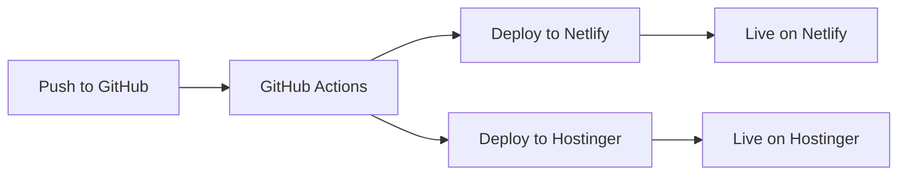

# 🚀 CI/CD Deployment Guide

This guide will help you set up automated deployment using Git and GitHub Actions for both Netlify and Hostinger.

## 📋 Prerequisites

- GitHub account
- Netlify account (free)
- Hostinger account with FTP access
- Git installed locally

## 🔧 Setup Steps

### 1. Create GitHub Repository

1. Go to [GitHub.com](https://github.com) and create a new repository
2. Name it: `birthday-card-website`
3. Make it **Public** (for free Netlify)
4. **Don't** initialize with README (we already have files)

### 2. Push Your Code to GitHub

```bash
# Add your GitHub repository as remote
git remote add origin https://github.com/YOUR_USERNAME/birthday-card-website.git

# Push your code
git branch -M main
git push -u origin main
```

### 3. Set Up Netlify

#### Option A: Connect GitHub Repository
1. Go to [Netlify.com](https://netlify.com) and sign up/login
2. Click "New site from Git"
3. Choose "GitHub" and authorize
4. Select your `birthday-card-website` repository
5. Deploy settings:
   - **Build command**: `echo 'No build required'`
   - **Publish directory**: `.` (root)
6. Click "Deploy site"

#### Option B: Get Site ID and Auth Token
1. After deployment, go to Site settings → General
2. Copy your **Site ID**
3. Go to User settings → Applications → Personal access tokens
4. Create a new token with name "GitHub Actions"
5. Copy the **Auth Token**

### 4. Set Up Hostinger FTP

1. Log in to your Hostinger control panel
2. Go to **Files** → **File Manager**
3. Note your FTP details:
   - **Host**: `ftp.yourdomain.com` or IP address
   - **Username**: Your FTP username
   - **Password**: Your FTP password
4. Ensure `public_html` folder exists

### 5. Configure GitHub Secrets

Go to your GitHub repository → **Settings** → **Secrets and variables** → **Actions**

Add these secrets:

#### For Netlify:
- `NETLIFY_AUTH_TOKEN`: Your Netlify personal access token
- `NETLIFY_SITE_ID`: Your Netlify site ID

#### For Hostinger:
- `HOSTINGER_FTP_HOST`: Your FTP host (e.g., `ftp.yourdomain.com`)
- `HOSTINGER_FTP_USERNAME`: Your FTP username
- `HOSTINGER_FTP_PASSWORD`: Your FTP password

## 🎯 How It Works

### Automatic Deployment
- **Push to main branch** → Triggers deployment to both Netlify and Hostinger
- **Pull requests** → Shows preview deployment on Netlify
- **Every commit** → Updates both sites automatically

### Deployment Process
1. GitHub Actions runs on every push
2. Code is checked out and validated
3. **Netlify**: Deploys via Netlify API
4. **Hostinger**: Uploads files via FTP
5. Both sites are updated simultaneously

## 🔄 Workflow



## 📝 Making Changes

1. **Edit files locally**
2. **Commit changes**: `git add . && git commit -m "Update message"`
3. **Push to GitHub**: `git push origin main`
4. **Automatic deployment** happens within 2-3 minutes

## 🛠️ Customization

### Update package.json
Edit the `package.json` file to update:
- Repository URL
- Author name
- Homepage URL

### Modify Deployment
Edit `.github/workflows/deploy.yml` to:
- Change deployment conditions
- Add more deployment targets
- Modify build process

## 🐛 Troubleshooting

### Netlify Issues
- Check `NETLIFY_AUTH_TOKEN` and `NETLIFY_SITE_ID` secrets
- Verify repository permissions
- Check Netlify build logs

### Hostinger Issues
- Verify FTP credentials
- Check `public_html` folder permissions
- Ensure FTP access is enabled

### GitHub Actions Issues
- Check Actions tab for error logs
- Verify all secrets are set correctly
- Ensure repository has Actions enabled

## 🎉 Benefits

- **Automatic deployments** on every push
- **Dual hosting** (Netlify + Hostinger)
- **Version control** with Git
- **Rollback capability** via Git history
- **Preview deployments** for pull requests
- **Free hosting** on both platforms

## 📞 Support

If you encounter issues:
1. Check GitHub Actions logs
2. Verify all secrets are correct
3. Test FTP connection manually
4. Check Netlify deployment logs

Your birthday card website will be automatically deployed to both platforms whenever you push changes to GitHub! 🎁
